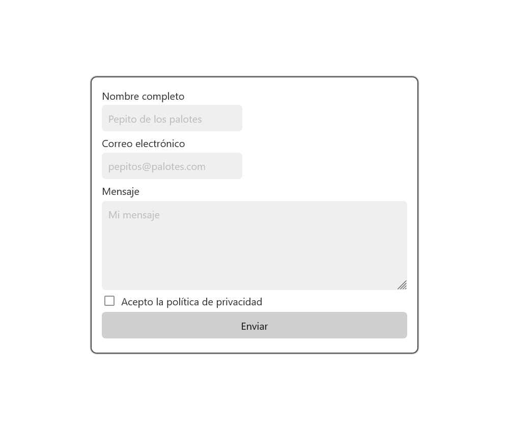
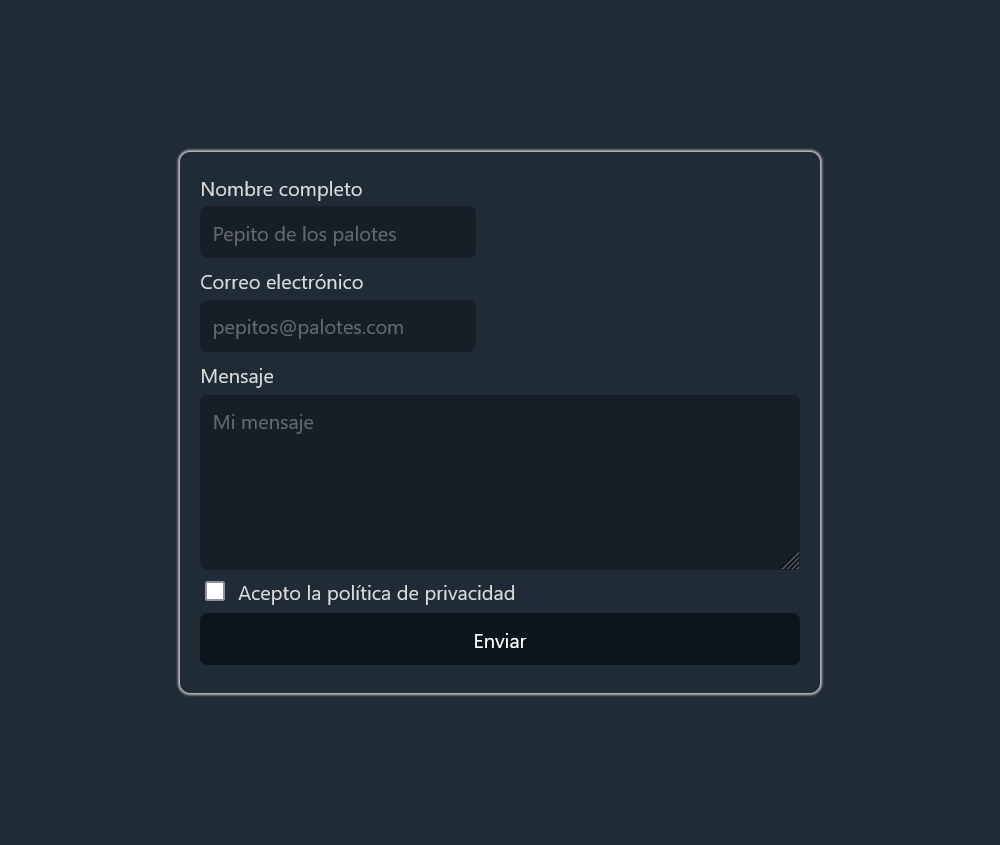

# Taller de formulario

## Instrucciones

Genera todo el código HTML para reproducir las capturas de pantalla
Pautas:
- Utiliza para el css la librería water.css (dispone ya del modo oscuro y claro)
- Crea un fichero css adicional si te hace falta
- Valida el formulario
  - Todos los controles de formulario deben de ser de tipo texto incluido el email
  - La única excepción del punto anterior es el botón el el control de formulario de tipo checkbox
  - No vale utilizar el atributo required
- Genera todos los mensajes de error que consideres oportuno
- Si este es validado se enviará la información al correo electrónico puesto por el usuario en el control de formulario

## Screenshots

### Light mode

### Dark mode

### Errores
